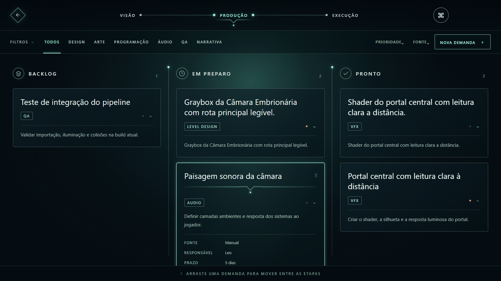
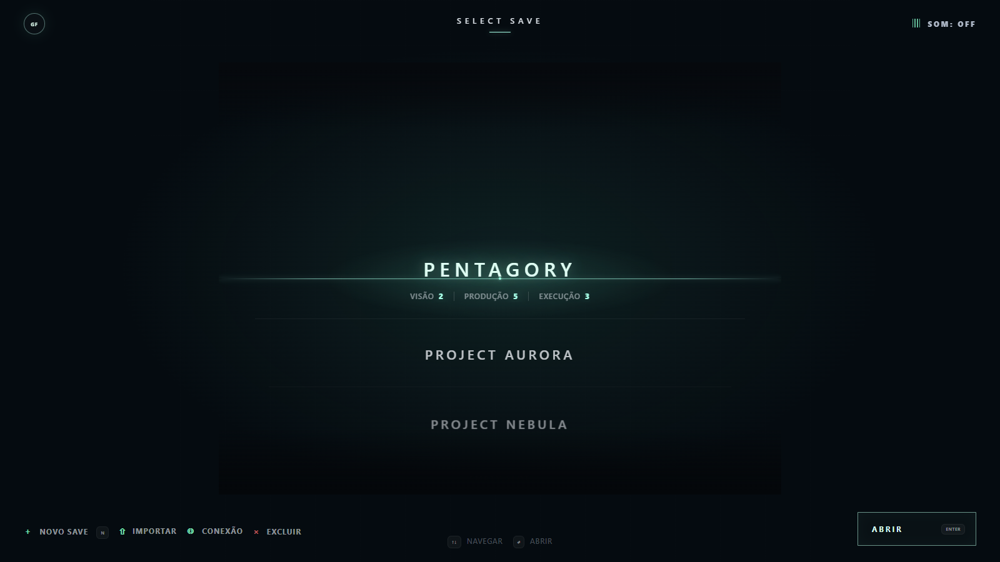
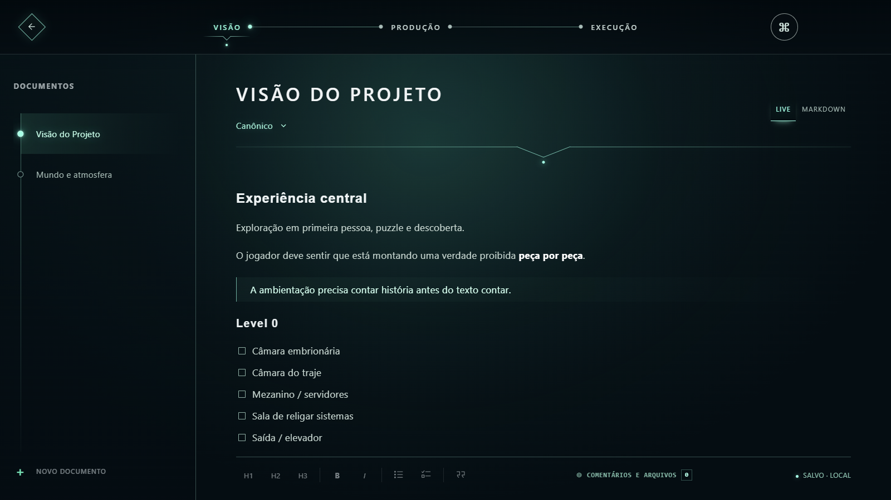
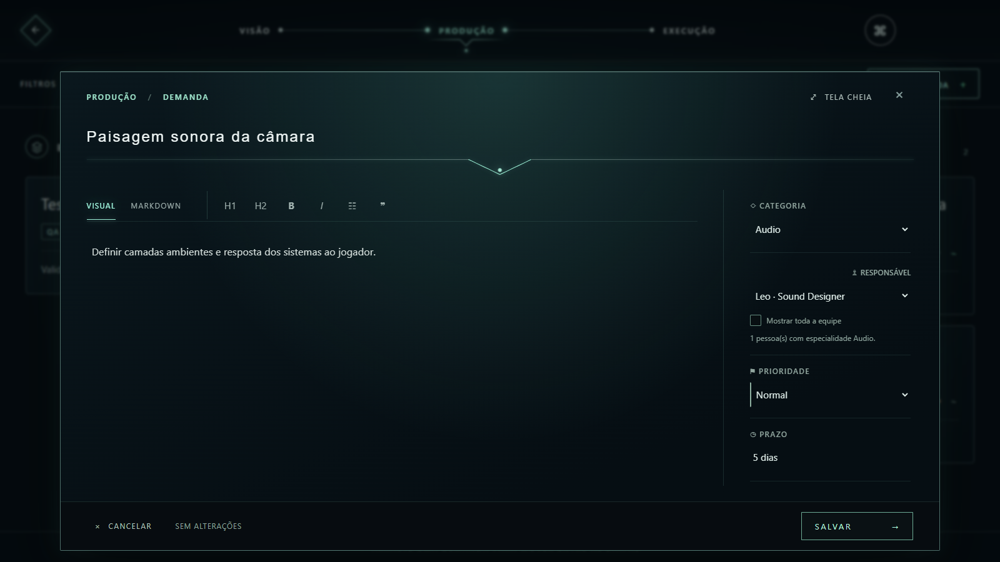
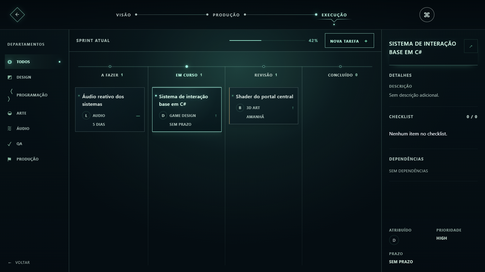
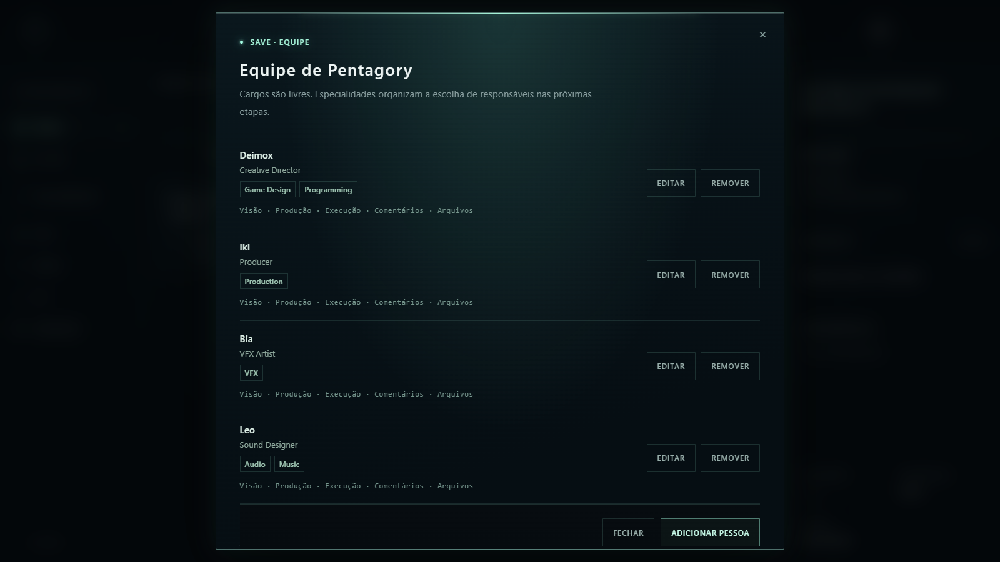

# GameForge Flow

**Um fluxo local-first para transformar visão criativa em trabalho executável na produção de jogos.**

O GameForge Flow organiza projetos em três etapas conectadas: **Visão**, **Produção** e **Execução**. A proposta é manter a direção criativa limpa, permitir que produção faça a triagem e o planejamento, e entregar tarefas claras para cada especialidade da equipe — tudo em uma interface inspirada em UI de videogame.



## O fluxo

```text
VISÃO  →  PRODUÇÃO  →  EXECUÇÃO
ideia      triagem      trabalho
```

| Etapa | Responsabilidade |
| --- | --- |
| **Visão** | Documentar intenção, experiência, narrativa, referências e decisões criativas. |
| **Produção** | Interpretar a visão, classificar demandas, definir prioridade, prazo e responsável. |
| **Execução** | Acompanhar tarefas, dependências, subtarefas, revisão e conclusão. |

## Principais recursos

- Saves independentes, cada um com seus próprios documentos, demandas, tarefas e equipe.
- Editor de Visão com Markdown, modo visual e envio contextual de trechos para Produção.
- Quadro de Produção com filtros, prioridades, responsáveis e movimentação entre etapas.
- Quadro de Execução por departamentos, progresso da sprint, checklist e dependências.
- Equipe por Save com cargos livres, múltiplas especialidades e permissões granulares.
- Comentários e anexos em documentos, demandas e tarefas.
- Colaboração pela rede local, Radmin VPN ou túnel HTTPS externo.
- Presença em tempo quase real, recuperação de rascunhos e proteção contra sobrescrita concorrente.
- Servidor MCP para consultar e manipular o fluxo por agentes compatíveis.
- Interface responsiva testada de 390 px até 2560 px, com suporte a redução de movimento.

## Galeria

### Saves e direção criativa

Cada Save representa um projeto independente. A Visão concentra somente o contexto criativo, sem antecipar decisões que pertencem à Produção.

| Seleção de Save | Visão do projeto |
| --- | --- |
|  |  |

### Produção

Demandas são distribuídas entre backlog, preparo e pronto. O editor mantém o Markdown em uma área ampla e deixa planejamento e atribuição em uma coluna separada.



### Execução e equipe

A Execução oferece leitura rápida da sprint por departamento. A equipe determina quais pessoas aparecem como responsáveis conforme suas especialidades.

| Execução | Equipe do Save |
| --- | --- |
|  |  |

## Instalação rápida

### Requisitos

- Windows 10 ou 11.
- Python 3 disponível no sistema.
- Um navegador moderno.
- ngrok ou Radmin VPN apenas se a equipe estiver fora da mesma rede física.

### Executar sem instalar

1. Baixe ou clone este repositório.
2. Abra [`outputs/GameForge_Flow_v0.4`](outputs/GameForge_Flow_v0.4).
3. Execute `START.bat`.
4. O aplicativo será aberto em `http://127.0.0.1:8765`.

> A pasta mantém o nome histórico `v0.4`, mas o aplicativo e o servidor contidos nela estão na versão **v0.9.0**.

### Instalar um atalho

Execute `INSTALL.bat`. Os arquivos serão copiados para o perfil local do Windows e um atalho será criado na Área de Trabalho.

Também existe um pacote pronto em [`outputs/GameForge_Flow_v0.9.0.zip`](outputs/GameForge_Flow_v0.9.0.zip).

## Colaboração

### Mesmo computador

Os Saves ficam no navegador e funcionam sem conta ou conexão externa.

### Rede local ou Radmin VPN

1. O host inicia o aplicativo com `START.bat`.
2. Em **Conexão**, hospeda o Save desejado.
3. O GameForge Flow mostra os endereços de rede disponíveis.
4. O host escolhe um membro da equipe e gera o convite.
5. O membro abre o link no próprio navegador.

Cada convite corresponde a uma pessoa da equipe e herda suas permissões no Save.

### Acesso externo por túnel

Com o servidor aberto, execute `START_TUNNEL.bat`. O ngrok exibirá uma URL HTTPS que pode ser usada como endereço do convite.

> Não exponha a porta HTTP diretamente à internet. Links de convite e a chave do host funcionam como credenciais e não devem ser publicados.

## Equipe e permissões

Uma pessoa pode ter várias especialidades, como Game Design, Programming, Level Design, 2D/3D Art, Animation, VFX, Technical Art, UI/UX, Audio, Music, Narrative, QA ou Production.

As permissões são configuradas separadamente para:

- Visão;
- Produção;
- Execução;
- comentários;
- arquivos;
- gerenciamento da equipe;
- configurações.

Assim, uma demanda de VFX pode listar primeiro quem realmente trabalha com VFX, sem impedir que a equipe completa seja consultada quando necessário.

## Comentários e arquivos

Documentos, demandas e tarefas possuem comunicação contextual.

- No modo local, anexos ficam dentro do Save do navegador e aceitam até **1,5 MB**.
- Em uma sessão compartilhada, os arquivos ficam no computador host e aceitam até **6 MB**.
- Comentários compartilhados registram autor e horário no servidor.

## MCP

O arquivo [`mcp_server.py`](outputs/GameForge_Flow_v0.4/mcp_server.py) implementa um servidor MCP por `stdio`, sem dependências externas.

### Configurar

1. Hospede ou retome um Save.
2. Copie o ID da sala exibido em **Conexão**.
3. Abra o PowerShell na pasta do aplicativo.
4. Execute:

```powershell
./CONFIGURE_MCP.ps1 -RoomId "ID_DA_SALA"
```

5. Copie a configuração gerada em `mcp-config.generated.json` para o cliente MCP desejado.

O arquivo gerado contém a chave do host, fica ignorado pelo Git e não deve ser compartilhado. Sem `GAMEFORGE_HOST_KEY`, o MCP permanece com escrita bloqueada.

### Ferramentas disponíveis

- `list_projects`
- `get_project_summary`
- `list_team`
- `read_document`
- `create_demand`
- `update_demand`
- `create_task`
- `update_task`
- `add_comment`

O servidor também expõe recursos de Save e documentos por URIs `gameforge://`.

## Dados e segurança

- O funcionamento padrão é local-first.
- Dados hospedados ficam em `GameForge_Flow_Data`, fora da pasta pública do aplicativo.
- A chave real do host não é incluída neste repositório.
- Tokens de convite ficam no fragmento da URL, evitando envio ao servidor durante a navegação inicial.
- Atualizações usam revisão do Save; um cliente desatualizado recebe conflito em vez de sobrescrever mudanças novas.
- O servidor publica somente uma lista restrita de arquivos estáticos.

## Estrutura do repositório

```text
outputs/GameForge_Flow_v0.4/   aplicativo atual
outputs/GameForge_Flow_v0.9.0.zip
docs/screenshots/              imagens deste README
scripts/                       automações de manutenção
tests/                         testes de interface, domínio, servidor e MCP
work/                          protótipo original v0.3
recovered-shell/               snapshot intermediário recuperado
```

## Testes

A versão atual possui **94 testes de interface** e **14 testes de servidor/MCP**.

```powershell
$tests = Get-ChildItem tests -File | Where-Object Extension -in '.cjs','.mjs'
node --test $tests.FullName
python -m unittest discover -s tests -p 'test_*.py'
```

O teste visual cobre múltiplas resoluções, estabilidade de hover, filtros, drag-and-drop, modais, redução de movimento e erros em tempo de execução.

Para atualizar as imagens do README com dados fictícios e um navegador isolado:

```powershell
node scripts/capture-readme-screenshots.cjs
```

## Estado atual

Versão: **0.9.0**

O ciclo principal já contempla criação do Save, organização da equipe, direção criativa, triagem, execução, colaboração, comentários, arquivos e MCP. Os próximos passos naturais são empacotamento totalmente independente do Python e refinamentos adicionais de sincronização e distribuição.
